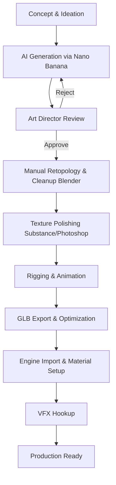

# 📖 Archery dApp: Asset Production Bible

**Version:** 1.0.0
**Role:** AAA Art Director & Technical Artist Team
**Purpose:** Single Source of Truth untuk seluruh standar visual dan pipeline produksi aset menggunakan AI (Nano Banana) dan manual polishing.

---

## 1. GAME IDENTITY

Identitas visual game dirancang untuk menarik pemain kasual maupun *hardcore* (Web2 & Web3), memberikan nuansa kompetitif namun tetap menyenangkan dan *visually rewarding*.

| Atribut | Deskripsi |
| :--- | :--- |
| **Visual Pillars** | 1. **Clarity over Clutter:** Siluet mudah dibaca.<br>2. **Rewarding Feedback:** Efek visual memuaskan saat *hit*.<br>3. **Tactile Material:** Material terasa "bisa disentuh" (kayu, logam, kristal). |
| **Mood** | Triumphant, Epic, Relaxing (saat berlatih), Tense (saat kompetisi). |
| **Atmosphere** | Cerah, *vibrant*, *inviting*, dengan elemen magis yang subtle. |
| **Target Audience** | Mid-core gamers, kolektor NFT, penggemar casual sports/archery. |
| **Fantasy Level** | High Fantasy / Mythical (terutama di *tier* atas). |
| **Realism Level** | Semi-Realistic (Material PBR) dengan bentuk *Stylized*. |
| **Stylization Level** | High (Proporsi dilebih-lebihkan, *chunky*, *bold edges*). |
| **Visual Language** | Kurva dinamis untuk kelincahan, sudut tajam untuk *power/damage*. |
| **Color Language** | Analogous dengan *accent* komplementer yang kuat. |
| **Silhouette Style** | Jelas, ikonik, dapat dikenali dari kejauhan dalam 1 detik. |
| **Shape Language** | Segitiga (Agresi/Kecepatan), Lingkaran (Pertahanan/Magis), Persegi (Kekuatan/Stabil). |
| **Material Style** | PBR (Physically Based Rendering) namun *stylized roughness* dan *clean albedo*. |
| **Lighting Style** | *Stylized* dengan *baked ambient occlusion*, *rim light* yang kuat, dan bayangan lembut. |
| **World Style** | *Vibrant Fantasy*, bersih dari *noise* visual yang tidak perlu. |

---

## 2. ART STYLE DECISION MATRIX

Pemilihan *art style* dievaluasi berdasarkan kesesuaian dengan *Game Engine* (Three.js), efisiensi AI *generation*, dan daya tarik *market*.

| Art Style | Pros | Cons | Decision |
| :--- | :--- | :--- | :--- |
| **Realistic** | Detail tinggi, imersif | Terlalu berat untuk WebGL, AI rawan *uncanny valley* | ❌ Reject |
| **Low Poly** | Sangat ringan, mudah dibuat | Terlihat murah, sulit jual kosmetik premium | ❌ Reject |
| **Anime/Cel-Shade** | Menarik, *trendy* | Shader khusus, *lighting* kurang dinamis | ❌ Reject |
| **Hand Painted** | Artistik, optimasi bagus | Butuh *skill* manual tinggi, AI sulit konsisten | ❌ Reject |
| **Stylized PBR** | **Kualitas AAA, material *readable*, cocok untuk Three.js, AI (Nano Banana) mudah dilatih.** | Membutuhkan tekstur PBR lengkap (Normal, Roughness) | ✅ **APPROVED** |

> [!IMPORTANT]
> **OFFICIAL STYLE: Stylized PBR (Fantasy/Modern Hybrid)**
> Seluruh aset harus menggunakan bentuk yang *stylized* (proporsi berani, *chunky*, *beveled edges*) namun dirender dengan material PBR yang realistis (logam memantulkan cahaya, kayu memiliki *grain* kasar). Referensi terdekat: *Overwatch*, *Valorant*, *Zelda: Breath of the Wild* (dengan PBR).

---

## 3. WORLD DESIGN (ENVIRONMENT)

Setiap *Range* (Arena) harus memiliki identitas warna dan *lighting* yang unik.

| Arena | Tema & Deskripsi | Dominant Color | Lighting Style |
| :--- | :--- | :--- | :--- |
| **Training Range** | Tempat latihan dasar. Aman, cerah, damai. | Hijau, Coklat Muda | Siang hari, cerah, *sunlight* hangat |
| **Forest Range** | Hutan rimbun kuno dengan reruntuhan. | Hijau Tua, Emerald | Sore hari, *god rays* melalui pepohonan |
| **Castle Range** | Halaman kastil kerajaan dengan bendera. | Abu-abu batu, Merah | Pagi hari, *crisp*, berkabut tipis |
| **Snow Range** | Pegunungan bersalju yang dingin. | Putih, Cyan, Biru Es | Siang mendung, *soft shadow*, partikel salju |
| **Desert Range** | Padang pasir dan tebing bebatuan panas. | Orange, Kuning Pasir | Terik matahari (*high contrast*), efek *heatwave* |
| **Night Range** | Hutan mistis bercahaya di malam hari. | Biru Tua, Ungu, Magenta| Bulan purnama, flora *bioluminescent* |
| **Festival Range** | Arena turnamen dengan lampion dan kembang api. | Merah, Emas, Pink | Malam hari, banyak *point lights* berwarna |
| **Future Seasonal** | Arena mekanikal/Sci-fi fantasy. | Hitam, Neon Blue | Gelap dengan aksen neon emisive |

---

## 4. VISUAL RULES (COLOR CONSISTENCY)

Untuk menjaga harmoni, elemen dasar lingkungan harus mengikuti aturan warna (Hex) ini secara ketat:

- **Warna Kayu (Oak/Dasar):** Coklat hangat (`#6B4423` hingga `#8B5A2B`)
- **Warna Rumput:** Hijau segar, sedikit kekuningan (`#4CAF50` hingga `#7CB342`)
- **Warna Langit (Siang):** Biru cerah bergradasi (`#4A90E2` di atas, `#87CEEB` di horizon)
- **Warna Logam (Besi/Baja):** Abu-abu kebiruan netral (`#708090` dengan *metallic* 1.0)
- **Warna Emas (Royal):** Emas cerah ke-orange-an (`#FFD700` hingga `#FFA500`)
- **Warna Kulit (Leather):** Coklat kemerahan gelap (`#5C4033`)
- **Warna Kain (Dasar):** Merah marun kerajaan (`#800000`) atau Biru laut (`#000080`)
- **Warna Batu:** Abu-abu hangat berlumut (`#808080` + aksen `#556B2F`)
- **Warna Target (Bullseye):** Kuning cerah (`#FFE600`), Merah tajam (`#FF0000`), Biru (`#00A8E8`)
- **Warna UI:** Dark mode elegan (`#111827`) dengan aksen Emas (`#FBBF24`)

---

## 5. WEAPON DESIGN (BOWS)

Busur adalah kosmetik utama. Desain harus berevolusi dari sederhana menjadi sangat kompleks.

| Kategori | Shape | Material | Color | Decoration | VFX / Animation |
| :--- | :--- | :--- | :--- | :--- | :--- |
| **Beginner** | Simpel, ramping | Kayu biasa, Tali kasar | Coklat kayu, Putih kusam | Polos, tanpa ukiran | Standar lentur |
| **Hunter** | Ergonomis, kokoh | Kayu keras, Kulit binatang | Coklat tua, Hijau rimba | Tali pengikat, bulu | Debu ringan saat ditarik |
| **Royal** | Elegan, simetris | Kayu halus, Emas, Velvet | Mahoni, Emas, Merah | Permata kecil, ukiran emas | Kilauan emas (Glint) |
| **Knight** | Kaku, industrial | Baja, Besi, Kulit hitam | Silver, Hitam, Abu-abu| Baut, pelindung tangan logam| Suara mekanik, percikan api |
| **Elven** | Melengkung dinamis| Kayu mistis, Sulur | Hijau zamrud, Silver | Daun menyala, sulur hidup | Partikel daun jatuh, angin |
| **Dragon** | Agresif, bersisik | Tulang naga, Obsidian, Magma | Hitam, Merah, Orange | Mata naga (Emissive) | Asap, api kecil di ujung busur |
| **Mythic** | Tidak rasional, melayang| Kristal, Energi murni | Cyan terang, Ungu | Pecahan melayang (*floating*) | Energi *glow*, trail saat bergerak |
| **Legendary**| Sangat kompleks | Ethereal, Emas murni | Tergantung tema (Dewa) | Aura penuh | Sayap cahaya terbuka saat *full draw*|

---

## 6. ARROW DESIGN

Anak panah harus memiliki *Readability* tinggi saat melayang di udara.

| Jenis Arrow | Shaft Material | Arrowhead | Fletching (Bulu) | Trail Effect |
| :--- | :--- | :--- | :--- | :--- |
| **Wood Arrow** | Kayu oak | Besi tumpul | Bulu putih | Tipis, abu-abu putih |
| **Steel Arrow** | Baja hitam | Baja runcing, tajam | Bulu merah / logam tipis| Garis silver tegas |
| **Crystal Arrow** | Kaca ajaib tembus pandang | Kristal tajam | Bulu energi cyan | *Sparkle* biru terang |
| **Fire Arrow** | Kayu hangus | Obsidian panas | Bulu api menyala | Asap tebal, trail api orange |
| **Ice Arrow** | Es abadi | Es runcing berduri | Bulu biru es | Kabut es, *snowflakes* |
| **Lightning Arrow**| Tembaga konduktif | Besi bermuatan | Bulu kuning neon | Kilatan listrik acak (Zaps) |
| **Shadow Arrow** | Gelap gulita (Vantablack) | Kristal ungu | Kabut asap hitam | Trail ungu gelap yang tersedot |
| **Nature Arrow** | Ranting pohon hidup | Batu flint | Daun hijau | Daun gugur berwarna hijau |

---

## 7. TARGET DESIGN

Target bukan sekadar sasaran, tapi *entity* dengan identitas.

| Jenis Target | Visual Identity | Hit Behavior |
| :--- | :--- | :--- |
| **Training Target** | Jerami melingkar standar, papan kayu. | Jerami berhamburan saat kena. |
| **Royal Target** | Berlapis emas, bantal beludru. | Bunyi lonceng, koin emas virtual terlempar. |
| **Moving Target** | Menggunakan rel mekanik di bawahnya. | Rel mengeluarkan bunga api. |
| **Mechanical Target**| Terbuat dari roda gigi perunggu, *steampunk*. | Roda gigi berputar cepat saat kena panah. |
| **Festival Target** | Lampion besar bertanda *Bullseye*. | Kertas lampion sobek, *confetti* meledak. |
| **Boss Target** | Monster diam atau naga batu dengan titik vital. | Mata menyala, efek getaran besar (*screen shake*). |

---

## 8. COSMETIC CATEGORIES

| Kategori | Definisi | Implementasi |
| :--- | :--- | :--- |
| **Bow Skin** | Model 3D penuh busur pengganti (*mesh swap*). | File `.glb` di *EquipmentManager*. |
| **Arrow Skin** | Model 3D proyektil. | File `.glb` saat panah ditarik dan ditembak. |
| **Trail** | Efek visual garis di belakang panah. | VFX Particle System & Ribbon Trail. |
| **Impact Effect** | Ledakan partikel saat panah mengenai target. | VFX Manager *spawn particle system*. |
| **Banner** | Bendera vertikal di belakang pemain di lobi. | Tekstur 2D pada *plane* 3D di lobi. |
| **Avatar Frame** | Bingkai foto profil pemain. | UI PNG (Alpha). |
| **Title Badge** | Gelar di bawah nama (misal: "Sharpshooter"). | UI PNG Icon + Teks. |
| **Emote** | Animasi karakter atau stiker ekspresi. | UI / 3D Animation clip. |

---

## 9. VFX STYLE GUIDE

Seluruh VFX menggunakan pendekatan **Stylized / Anime-esque**. Hindari debu atau api yang realistis dan bertekstur *noise* tinggi. Gunakan bentuk solid (lingkaran, segitiga) yang menyusut dan menghilang.

- **Wind:** Garis-garis putih semi-transparan yang melengkung cepat (*speed lines*).
- **Hit Spark:** Bintang berujung tajam (*starburst*) dengan kilatan *bloom* tinggi.
- **Perfect Shot (Bullseye):** Gelombang kejut bulat (*shockwave ring*) melebar + *Confetti* emas.
- **Legendary Effect:** Aura partikel melayang ke atas dengan pendaran *glow* intens.

---

## 10. ENVIRONMENT ASSET LIST

Aset environment dibangun secara modular agar mudah dirakit menjadi *Range* baru.

- **Terrain:** Ground Patch, Grass Patch, Rock (Small, Medium, Large, Cliff).
- **Vegetation:** Oak Tree, Pine Tree, Dead Tree, Bush (Round, Spiky).
- **Props:** Wooden Fence, Target Stand, Tent, Campfire.
- **Background (Distant):** Mountain Silhouette, Stylized Cloud (Fluffy), Skybox Dome.
- **Decor:** Flags (Wind responsive), Wind Sock (Untuk indikator angin), Lantern, Bridge.

---

## 11. UI STYLE & ICONOGRAPHY

**Tipe Desain:** Modern Glassmorphism bertemu Fantasy Elegance.

- **Button:** *Rounded corners* (8px), warna solid terang untuk *call-to-action*, *hover state* membesar 1.05x dengan *inner glow*.
- **Panel:** Transparan (`#000000` dengan opacity 60%), *Backdrop blur* (12px), *border* tipis emas/putih.
- **Tooltip:** Solid hitam legam dengan teks putih tegas agar sangat mudah dibaca.
- **Typography:** 
  - **Heading:** Font *Display/Fantasy* tebal (Mewakili Game).
  - **Body:** Font Sans-serif bersih (seperti Inter / Roboto) untuk keterbacaan maksimum.
- **Icon Style:** **Filled + Flat Minimal** dengan *outline* tipis.
  - Untuk UI umum: Putih polos atau Abu-abu.
  - Untuk *Item Icons*: Render 3D ortografis dengan *background* warna sesuai *rarity*.

---

## 12. COLOR PALETTE (OFFICIAL)

| Fungsi | Hex Code | Swatch |
| :--- | :--- | :--- |
| **Primary (Brand)** | `#EAB308` (Yellow-500) | Emas panahan utama |
| **Secondary (Brand)**| `#F97316` (Orange-500) | Aksen energi/panas |
| **Background (UI)** | `#111827` (Gray-900) | Hitam/Biru sangat gelap |
| **Warning / Alert** | `#EF4444` (Red-500) | Merah bahaya / Error |
| **Success** | `#10B981` (Emerald-500)| Hijau berhasil |
| **Common Rarity** | `#9CA3AF` (Gray-400) | Abu-abu |
| **Rare Rarity** | `#3B82F6` (Blue-500) | Biru |
| **Epic Rarity** | `#A855F7` (Purple-500) | Ungu |
| **Legendary Rarity** | `#F59E0B` (Amber-500) | Emas Terang |

---

## 13. MATERIAL LIBRARY (PBR STANDARDS)

*Guideline* untuk membuat tekstur agar konsisten saat di render di Three.js.

| Material | Base Color (Albedo) | Roughness | Metallic | Keterangan |
| :--- | :--- | :--- | :--- | :--- |
| **Stylized Wood** | Coklat (*High Saturation*) | `0.8 - 0.9` | `0.0` | Grain kayu digambar secara *painted*, minim noise. |
| **Steel / Iron** | Abu-abu terang / gelap | `0.3 - 0.5` | `1.0` | Tambahkan *edge highlight* palsu di tekstur Albedo. |
| **Gold** | Kuning / Emas cerah | `0.2 - 0.4` | `1.0` | Sangat memantulkan lingkungan, *specular* tinggi. |
| **Leather** | Coklat kemerahan gelap | `0.7 - 0.8` | `0.0` | Halus, *matte*. |
| **Crystal** | Cyan / Pink / Ungu | `0.1` | `0.0` | Gunakan *Transmission/Refraction* shader atau *Emissive*. |

---

## 14. 3D ASSET SPECIFICATION

Spesifikasi teknis ketat untuk menjamin performa (60 FPS di Web/Mobile Web).

| Spesifikasi | Bows | Arrows | Environment / Targets |
| :--- | :--- | :--- | :--- |
| **Format** | `.glb` (Binary GLTF) | `.glb` | `.glb` |
| **Polycount (Triangles)**| `1k - 3k` max | `200 - 500` max | `500 - 5k` max (Tergantung ukuran) |
| **Texture Res (Max)** | `1024x1024` | `512x512` | `2048x2048` (Atlas) |
| **Texture Maps** | Color, MRAO (Metal/Rough/AO) | Color (Unlit/Emissive) | Color, MRAO |
| **Pivot / Origin** | Terpusat di pegangan tangan (Grip) | Terpusat di pangkal (Nock) | `0,0,0` di dasar bawah (tanah) |
| **Scale** | `1 unit = 1 meter` | `1 unit = 1 meter` | `1 unit = 1 meter` |
| **Animation** | Skinned mesh (Tali ditarik) | Tidak ada | Terpisah bila perlu (Misal target bergerak) |

---

## 15. TEXTURE SPECIFICATION (OPTIMIZATION)

- **Texture Packing:** Wajib menggunakan Channel Packing.
  - Red Channel = **M**etallic
  - Green Channel = **R**oughness
  - Blue Channel = **A**mbient Occlusion (MRAO Map).
- **Compression:** Gunakan kompresi **KTX2 / Basis Universal** saat *build pipeline* jika memungkinkan, atau *WebP* untuk `.gltf` eksternal.
- **Color Space:** Albedo harus sRGB. MRAO dan Normal map harus Linear/Non-Color.

---

## 16. NAMING CONVENTION

Standar penamaan file wajib menggunakan `snake_case`.

| Tipe Aset | Format Naming | Contoh |
| :--- | :--- | :--- |
| **Models** | `[type]_[name]_[tier].glb` | `bow_dragon_legendary.glb`, `arrow_ice_epic.glb` |
| **Textures** | `T_[asset]_[map].png` | `T_bow_dragon_Albedo.png`, `T_bow_dragon_MRAO.png` |
| **Audio** | `SFX_[action]_[variant].mp3` | `SFX_bow_release_01.mp3`, `SFX_hit_bullseye.mp3` |
| **UI Icons** | `IC_[category]_[name].png` | `IC_shop_gold.png`, `IC_bow_dragon.png` |

---

## 17. FOLDER STRUCTURE

```text
/public
└── /assets
    ├── /models
    │   ├── /bows
    │   ├── /arrows
    │   ├── /targets
    │   └── /environment
    ├── /textures
    │   ├── /materials
    │   └── /vfx
    ├── /audio
    │   ├── /sfx
    │   └── /bgm
    └── /ui
        ├── /icons
        ├── /thumbnails
        └── /banners
```

---

## 18. AI GENERATION GUIDELINE (NANO BANANA)

Aset akan dihasilkan oleh AI Nano Banana. Ikuti *prompting rules* berikut untuk menjaga konsistensi.

### Prompt Structure
`[Subject/Object], [Style Keywords], [Material Definition], [Lighting & Environment], [Camera Angle/Perspective], [Render Quality]`

### Prompt Example (Bow)
> "A highly detailed stylized fantasy bow, carved from ancient emerald wood and glowing gold metal, thick proportions, beveled edges, clean PBR material, studio lighting, isolated on solid white background, isometric view, 3D game asset render, masterpiece, 8k resolution, Unreal Engine 5 style."

### Negative Prompt
> "realistic, photo, messy, noisy, high frequency details, messy geometry, thin lines, fragile, 2d, illustration, sketch, text, watermark, bad topology, cluttered."

| Parameter | Aturan |
| :--- | :--- |
| **Camera** | Selalu minta *Orthographic view* atau *Isometric view* di atas *background* putih/netral untuk mempermudah ekstraksi tekstur/bentuk. |
| **Lighting** | *Studio lighting*, *3-point light* dengan *rim light* kuat agar siluet terbaca oleh AI. |
| **Seed Strategy** | Gunakan Seed yang sama saat melakukan iterasi perbaikan pada *mesh* yang sama. |
| **Reference Strategy**| Gunakan mode *Image-to-Image* (Img2Img) dengan *sketch* kasar bentuk busur agar AI tidak membuat bentuk *random* yang sulit di-rigging. |

---

## 19. QUALITY CHECKLIST

Sebelum aset masuk ke `main` branch, *Technical Artist* harus mengecek tabel ini:

- [ ] **Style:** Apakah proporsi cukup *chunky* (stylized) dan tidak terlalu realistis?
- [ ] **Scale:** Apakah skala sudah diset 1.0 pada 3D software (Blender/Maya) sebelum export?
- [ ] **Origin:** Apakah pivot point busur tepat di *hand grip*?
- [ ] **Topology:** Apakah mesh tidak tumpang tindih (*manifold*) dan bebas dari N-Gons?
- [ ] **Texture:** Apakah tekstur Albedo bersih (tanpa shadow berlebih) dan MRAO diletakkan di *channel* yang benar?
- [ ] **Performance:** Apakah polygon count berada di bawah batas spesifikasi?
- [ ] **Naming:** Apakah nama file mematuhi *snake_case* standard?

---

## 20. PRODUCTION PIPELINE WORKFLOW



---

## 21. ASSET ROADMAP

Urutan eksekusi prioritas aset:

| Prioritas | Kategori Aset | Daftar Aset Spesifik | Target Phase |
| :---: | :--- | :--- | :--- |
| **Priority 1** | **Core Gameplay** | Training Target, Wood Bow, Wood Arrow, Ground Mesh dasar. | MVP / Alpha |
| **Priority 2** | **Economy Starter**| Hunter Bow, Knight Bow, Steel Arrow, Fire Arrow. | Beta Shop |
| **Priority 3** | **Environment 1** | Pohon Oak, Rumput, Bebatuan, Langit (Skybox). | Forest Range |
| **Priority 4** | **Premium Items** | Elven Bow, Dragon Bow, Ice Arrow, Crystal Arrow. | Season 1 Launch |
| **Priority 5** | **VFX & Polish** | Trail kosmetik, Efek Legendary, Emotes, Banner Profil. | Live Ops |

---
*Dokumen ini adalah Single Source of Truth. Segala penyimpangan dari standar ini harus melalui persetujuan Art Director.*
