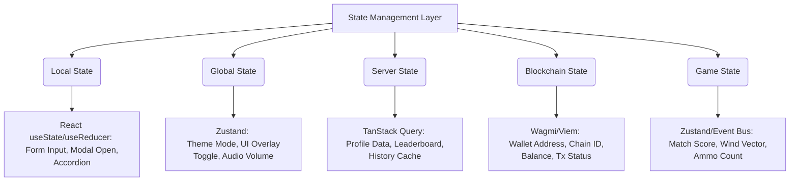

# Frontend Architecture & UI System Software Design Specification

## 1. Frontend Overview

### Filosofi Frontend
Frontend pada GameFi Archery dirancang dengan filosofi **"Orchestration Layer & Seamless Web3 Experience"**. Frontend bukan sekadar antarmuka statis, melainkan sebuah konduktor yang menyelaraskan berbagai subsistem kompleks (Game Engine 3D, Smart Contract, Wallet Provider, Backend API, dan WebSocket) menjadi satu kesatuan pengalaman yang mulus bagi pengguna. Kecepatan muat (*fast Time-to-Interactive*), responsivitas (*mobile-first*), dan abstraksi kompleksitas Web3 adalah prioritas utama.

### Batas Tanggung Jawab

| Komponen | Tanggung Jawab |
| :--- | :--- |
| **React / Next.js** | Menangani semua logika UI di luar arena permainan, otentikasi (SIWE), *routing*, manajemen *state* global, manajemen cache API, manajemen dompet (Wallet), dan penyajian (rendering) HUD yang melapisi *game canvas*. |
| **Game Engine** | Fokus 100% pada *rendering* 3D, simulasi fisika (Physics), input saat *gameplay*, logika tabrakan, dan pemutaran ulang (Ghost Replay) secara asinkron. |
| **Backend API** | Menangani logika bisnis (*Server-Authoritative*), validasi pencapaian, perhitungan ELO, penyimpanan metadata *inventory*, dan pemrosesan antrean *matchmaking*. |
| **Blockchain** | Sebagai *settlement layer* mutlak untuk kepemilikan aset (NFT), transaksi *Shop* premium, dan pencetakan (minting) *Soulbound Token (SBT)*. |
| **Browser** | Menyediakan API perangkat keras (WebGL, WebAudio), penyimpanan cache persisten (*Service Worker* / IndexedDB), dan perlindungan *sandbox* keamanan (CSP, CORS). |

---

## 2. High Level Frontend Architecture

Arsitektur Frontend menggunakan hierarki terstruktur dari *Routing* hingga ke *Game Engine Bridge*.

```text
+-----------------------------------------------------------------------------------------+
|                                    NEXT.JS (APP ROUTER)                                 |
+-----------------------------------------------------------------------------------------+
|  +-----------------------------------------------------------------------------------+  |
|  |                                  LAYOUTS & PAGES                                  |  |
|  +-----------------------------------------------------------------------------------+  |
|          |                           |                             |                    |
|  +-----------------+       +-----------------+           +-----------------+          |
|  | FEATURE MODULES |       |  SHARED COMPS   |           | GAME COMPONENTS |          |
|  | (Shop, Profile) |       | (Buttons, Modal)|           | (HUD, Settings) |          |
|  +-----------------+       +-----------------+           +-----------------+          |
|          |                           |                             |                    |
|  +-----------------------------------------------------------------------------------+  |
|  |                                  REACT HOOKS                                      |  |
|  +-----------------------------------------------------------------------------------+  |
|          |                           |                             |                    |
|  +-----------------+       +-----------------+           +-----------------+          |
|  |   GLOBAL STATE  |       |   SERVER STATE  |           | BLOCKCHAIN STATE|          |
|  |    (Zustand)    |       | (TanStack Query)|           | (Wagmi / Viem)  |          |
|  +-----------------+       +-----------------+           +-----------------+          |
+-----------------------------------------------------------------------------------------+
|                                   ABSTRACTION LAYER                                     |
+-----------------------------------------------------------------------------------------+
|  +-----------------+       +-----------------+           +-----------------+          |
|  |    API LAYER    |       | WEBSOCKET LAYER |           |   GAME BRIDGE   |          |
|  |  (REST Client)  |       |  (Socket.io)    |           | (Event Emitter) |          |
|  +-----------------+       +-----------------+           +-----------------+          |
+-----------------------------------------------------------------------------------------+
|                                   EXTERNAL SYSTEMS                                      |
+-----------------------------------------------------------------------------------------+
|  [ Backend Server]         [ Backend Server]             [ Game Engine (WebGL) ]        |
|  [ Smart Contracts]                                                                     |
+-----------------------------------------------------------------------------------------+
```

---

## 3. Folder Structure

Struktur direktori dirancang berbasis fitur (Feature-Driven Architecture) agar skala proyek mudah dikelola.

* **`app/`**: Next.js App Router (*Layouts, Pages, Error Boundaries, Loading*).
* **`components/`**: Komponen UI fundamental (Dumb Components) yang membentuk *Design System*.
* **`features/`**: Modul fungsional spesifik domain (misal: `features/shop`, `features/inventory`), berisi *components, hooks, dan logic* lokal.
* **`game/`**: Modul penghubung React dengan Game Engine (Bridge, HUD, Canvas Wrapper).
* **`hooks/`**: *Custom Hooks* global yang dapat digunakan ulang lintas fitur.
* **`stores/`**: Manajemen *state* global (Zustand).
* **`services/`**: Modul pemanggil API (*REST Fetcher*, integrasi layanan pihak ketiga).
* **`wallet/`**: Konfigurasi koneksi Web3, *Smart Contract ABI*, dan logika Wagmi/Viem.
* **`providers/`**: *Context Provider Wrapper* (QueryClientProvider, WagmiConfig, ThemeProvider).
* **`layouts/`**: Komponen pembungkus halaman struktural (SidebarLayout, GameLayout).
* **`shared/`**: Tipe data umum (TypeScript interfaces) dan utilitas yang dibagikan.
* **`types/`**: Deklarasi tipe TypeScript global.
* **`constants/`**: Konstanta statis (Address Contract, Enum, Config variables).
* **`utils/`**: Fungsi pembantu murni (Formatters, Validators, Math).
* **`styles/`**: Konfigurasi Tailwind, CSS global, dan variabel CSS (*Design Token*).
* **`assets/`**: Gambar statis, ikon khusus, *font*.
* **`public/`**: Aset statis yang di-*serve* langsung di akar web (Manifest, Service Worker).
* **`config/`**: Konfigurasi lingkungan (Environment) dan inisialisasi modul pihak ketiga.
* **`lib/`**: Abstraksi *library* eksternal agar mudah diganti (misal: `lib/axios.ts`, `lib/logger.ts`).
* **`workers/`**: Skrip Web Worker untuk dekripsi atau pekerjaan berat di *background*.

---

## 4. Routing Architecture

Menggunakan paradigma hibrida (*Public*, *Protected*, *Game*) pada Next.js App Router.

* **`/` (Landing)**: Halaman statis (Public Route) untuk *marketing* & orientasi. Memanfaatkan *SEO & Server Component*.
* **`/home` (Dashboard)**: Protected Route. Beranda pemain dengan Avatar 3D statis.
* **`/play` (Game Lobby)**: Persiapan memilih mode.
* **`/play/practice`**: Mode lokal (*Nested Route*), memuat *Game Layout*.
* **`/play/pvp`**: Mode PvP kompetitif (*Nested Route*).
* **`/shop`**: Toko *on-chain* dan *off-chain*.
* **`/inventory`**: Inventaris kosmetik pemain (Grid UI & 3D Preview Modal).
* **`/profile/[id]`**: Profil publik pemain dan *Achievement* (Dynamic Route).
* **`/leaderboard`**: Klasemen Global (Server-Side Rendered/Static Revalidated).
* **`/history`**: Riwayat pertandingan pemain.
* **`/analytics`**: Dasbor grafik statistik pemain (Akurasi, Winrate).
* **`/settings`**: Pengaturan lokal akun.
* **`/admin`**: Panel khusus manajemen (Role-based Protected Route).

**Layouting**:
* *RootLayout*: Menangani Providers global.
* *AppLayout*: Memiliki Sidebar/Bottom Navigation (kecuali rute `/play`).
* *GameLayout*: Mengambil alih *viewport* 100% tanpa navigasi reguler (Immersive Mode).

---

## 5. Feature Module Architecture

| Module | Dependencies | Responsibility |
| :--- | :--- | :--- |
| **Authentication** | `wallet`, `api` | Menangani *Sign-In with Ethereum (SIWE)* dan pembuatan JWT dari backend. |
| **Wallet** | `ethers`/`viem` | Menjaga koneksi dompet, pindah jaringan (RPC), transaksi *on-chain*. |
| **Game** | `game-engine` | Mengikat *Canvas*, memberikan properti (*props*) HUD, mengelola antrean PvP. |
| **Shop** | `wallet`, `api` | Menampilkan etalase barang, kalkulasi harga, memicu transaksi *crypto* / pemotongan *soft currency*. |
| **Inventory** | `api`, `game` | Menampilkan Grid koleksi NFT dan *Off-chain*, memperbarui konfigurasi kosmetik ke *Backend* dan *Engine*. |
| **Equipment** | `inventory` | Sub-modul untuk mengelola slot pemakaian (*Bow, Skin, Banner*). |
| **Profile** | `api` | Menampilkan statistik pengguna, koleksi *Soulbound Token*, dan Avatar. |
| **Leaderboard** | `api`, `websocket` | Menampilkan peringkat yang diperbarui secara langsung/periodik. |
| **History & Analytics** | `api`, `charting` | Menampilkan rekaman skor pertandingan masa lalu dengan grafik visual. |
| **Achievement** | `api`, `wallet` | Memverifikasi syarat pencapaian dan mengurus transaksi klaim (Mint) SBT. |
| **Season & Mission** | `api` | Modul perkembangan *Battle Pass* dan klaim misi harian. |
| **Notification** | `websocket` | Modul global untuk *Toast* interaktif dan *Inbox* sistem. |

---

## 6. State Management

Pemisahan logika State dilakukan agar tidak terjadi tabrakan antara React Lifecycle dan Web3.



---

## 7. React $\leftrightarrow$ Game Engine Bridge

Arsitektur Bridge menggunakan **Event Emitter** terpusat agar Game Engine tidak perlu mengetahui keberadaan DOM/React, dan sebaliknya.

### Engine $\rightarrow$ React
* `onMatchStart`: React menyembunyikan *Loading Overlay* dan menampilkan HUD.
* `onScoreUpdate(score, combo)`: React memperbarui angka skor di sudut atas.
* `onWindChange(windData)`: React memutar indikator angin di UI.
* `onMatchEnd(results)`: React menampilkan *Result Modal* (Kemenangan/Kekalahan, XP, ELO).
* `onError(errorMsg)`: React menampilkan *Toast Alert* galat.

### React $\rightarrow$ Engine
* `engine.pause()`: React memanggil ketika tombol Pause ditekan di HUD atau *tab* kehilangan fokus.
* `engine.resume()`: Memulai kembali loop simulasi engine.
* `engine.equipItem(category, itemId)`: React memberitahu engine untuk memuat `.glb` baru saat pratinjau profil.
* `engine.loadReplay(replayData)`: React memulai scene khusus pemutaran *ghost*.
* `engine.updateSettings(config)`: React mengirim profil Volume, Kualitas Grafis ke engine.

---

## 8. Wallet Architecture

Sistem berfokus pada ketahanan (Resilience) dan keamanan di lingkungan Web3.

* **Koneksi**: Mendukung Metamask, WalletConnect, dan ekstensi peramban injeksi lainnya via abstraksi (Wagmi).
* **Siklus SIWE**: Koneksi $\rightarrow$ Tanda tangan pesan (Signature) $\rightarrow$ Kirim ke API $\rightarrow$ Terima JWT $\rightarrow$ Sesi valid.
* **Auto Reconnect**: Berjalan mulus ketika pengguna me-refresh halaman (mengingat *provider* terakhir).
* **Chain Switching**: Otomatis meminta pengguna memindahkan jaringan ke *chain* yang didukung sebelum transaksi *Smart Contract*.
* **Transaction Flow**:
  1. *Initiation* (Tombol beli ditekan).
  2. *Pending Approval* (Meminta persetujuan dompet, UI *loading* berputar).
  3. *Broadcasted* (Transaksi ada di *mempool*, UI menampilkan Toast peringatan "Menunggu Konfirmasi").
  4. *Confirmation* (Transaksi berhasil, UI melakukan *Cache Invalidation* untuk memuat ulang inventory).
* **Error Handling**: Penangkapan kesalahan spesifik (`User Rejected`, `Insufficient Funds`, `RPC Error`).

---

## 9. API Layer

* **Transport**: Menggunakan fungsi `fetch` asli atau abstraksi REST Client untuk memanggil Backend.
* **Server State**: Mutlak dikendalikan oleh **TanStack Query**.
  * **Cache**: Data persisten antar-tabulasi; data jarang berubah (seperti riwayat lama) memiliki *stale time* panjang.
  * **Retry**: Otomatis mencoba ulang 3 kali untuk galat 5xx atau interupsi jaringan dengan *Exponential Backoff*.
  * **Invalidation**: Menyapu cache otomatis ketika pengguna berhasil melakukan transaksi (Mutasi).
  * **Optimistic Update**: Di bagian seperti "Klaim Hadiah Misi", UI bereaksi sukses seketika tanpa menunggu penyelesaian API untuk kesan "instan", namun dapat me- *rollback* jika akhirnya gagal.
  * **Prefetch**: Menarik data penting (*Inventory*) selama layar *loading* di *Home* sebelum diarahkan.

---

## 10. WebSocket Layer

* **Connection**: Koneksi soket permanen (berbasis JWT) diinisialisasi begitu profil pengguna dimuat.
* **Resilience**: Mekanisme *Auto-reconnect* dan *Heartbeat/Ping-Pong* untuk mendeteksi rontoknya jaringan secara diam-diam (*silent drop*).
* **Global Channel**: Menerima pengumuman global (*System Event*), dan pembaruan 10 besar *Leaderboard*.
* **Private Channel**:
  * `NotificationReceived`: Notifikasi *Achievement* terbuka.
  * `InventoryUpdated`: Pemberitahuan dari *Web3 Indexer* backend bahwa NFT baru saja masuk ke dompet dan siap digunakan (sangat penting untuk menjembatani keterlambatan konfirmasi blok).
  * `MatchmakingReady`: Pemberitahuan ketika sistem menemukan *Ghost* yang cocok di backend.

---

## 11. UI Component System

Menggunakan prinsip *Atomic Design* yang ketat (Atom $\rightarrow$ Molekul $\rightarrow$ Organisme).

* **Atom**: `Button` (Primary, Secondary, Ghost, Icon), `Badge` (Rarity Color), `Avatar`, `Skeleton`, `Tooltip`.
* **Molekul**: `Card` (Item Shop Card, Match History Card), `Dropdown` (Menu Profil), `Tabs` (Kategori Inventory).
* **Organisme**: `Modal` (Konfirmasi Beli), `Drawer` (Navigasi Mobile), `Table` (Leaderboard dengan paginasi TanStack Table).
* **Ecosystem (Spesifik Domain)**:
  * `HUD`: Menggunakan *Absolute Positioning* melayang di atas *Game Canvas*.
  * `Loading Overlay`: Layar penuh menutupi transisi antar *route* atau inisialisasi Engine.
  * `Empty/Error State`: Komponen terpadu jika data Inventory kosong atau API gagal (`RetryButton`).

---

## 12. Design System

* **Token Warna (Color Token)**: Pendekatan palet HSL. Memiliki warna *Primary*, *Secondary*, *Accent* (Neon/Cyberpunk/Fantasy), *Background* (Gelap/Terang), dan *Semantic* (Sukses, Peringatan, Galat).
* **Tipografi**: Mengandalkan *Google Fonts* (misal: *Inter* untuk UI bacaan, *Outfit* untuk angka/skor, font *Display* tebal untuk judul).
* **Dark Mode**: Berbasis kelas (*class-based*) menggunakan `next-themes`. Variabel *Tailwind* dimodifikasi secara dinamis.
* **Glass Effect**: Jika arah desain modern (Glassmorphism), komponen menggunakan `backdrop-blur` dan warna *background* transparan untuk memadukan UI dengan *gameplay 3D* di belakangnya.
* **Icon System**: Memanfaatkan koleksi ikon vektor (seperti *Lucide Icons*) yang ringan.

---

## 13. Responsive Strategy

* **Desktop (1024px+)**: Sidebar penuh, tata letak Grid Shop 4-6 kolom, *HUD* lega di ujung layar.
* **Tablet (768px - 1023px)**: Sidebar menyempit (Ikon saja), Grid 3 kolom.
* **Mobile (Portrait & Landscape)**:
  * **UI Web**: Pindah ke *Bottom Navigation Bar* atau *Hamburger Menu*. Modal membesar memenuhi 100% tinggi layar.
  * **Game Canvas**: Menangani *resize observer* dan penyesuaian rasio aspek dengan ketat untuk memastikan FOV (sudut pandang) memanah tetap adil di *Portrait* (Layar lebar vertikal) vs *Landscape* (layar lebar horizontal).
  * **Safe Area**: Menghormati lekukan layar ponsel masa kini (`env(safe-area-inset)` di CSS) agar tombol UI tidak terpotong (notch).

---

## 14. Accessibility

Meskipun ini adalah game, UI pembungkus harus menjunjung tinggi standar web (a11y).

* **Keyboard Navigation**: Kemampuan melakukan tabulasi (`Tab`) untuk menavigasi elemen antarmuka di Dashboard.
* **Focus Management**: Modal secara otomatis menjebak (*trap*) fokus kursor selama terbuka.
* **ARIA Labels**: Penamaan atribut khusus untuk layar pembaca (*Screen Reader*) pada tombol ikon yang tidak memiliki teks.
* **Touch Target**: Minimal ukuran interaksi untuk layar sentuh ponsel (44x44 CSS pixel).
* **Reduced Motion**: Jika pengaturan OS (Prefers-reduced-motion) aktif, transisi *Framer Motion* akan diubah sekadar menjadi memudar (Fade) biasa.

---

## 15. Loading Strategy

* **Dynamic Import**: Komponen *Game Engine* (`<Canvas>`) dan aset berat hanya dimuat saat rute `/play` dieksekusi (*Lazy Loading*).
* **Image Optimization**: Menggunakan `next/image` untuk memproses ukuran *thumbnail* profil dan avatar ke format WebP secara otomatis.
* **Skeleton Screen**: Digunakan dalam memuat Data *Shop* dan *Inventory* daripada *Spinner* biasa agar mengurangi pergeseran tata letak kumulatif (CLS).
* **Asset Prefetch**: Rute utama (Shop, Profile) menggunakan *Prefetching* Next.js App Router agar transisi terasa instan.

---

## 16. Error Handling

* **ErrorBoundary**: Pembungkus tingkat tinggi di setiap *Feature Module* di Next.js (`error.tsx`). Jika satu modul (misal: *Shop*) *crash*, halaman *Dashboard* tidak ikut padam.
* **API Fallback**: Gagal terhubung ke API akan merender UI *Fallback* khusus ("Gagal Memuat Data - Coba Lagi").
* **RPC Error / Wallet Reject**: Dikelola secara bersih di tingkat kait (*hook*) transaksi Web3 dan dilempar (throw) sebagai peringatan ramah pengguna melalui *Toast*.
* **Game Error**: Jika WebGL mengalami kelumpuhan sementara, antarmuka akan memunculkan transisi ke menu *Home* beserta galat, tanpa merusak status dompet.

---

## 17. Performance Strategy

* **Server & Client Components**: Memaksimalkan *Server Components (RSC)* pada rute pendaratan (Landing) dan struktur dasar Layout untuk memperkecil *bundle JavaScript*. Menandai dengan `"use client"` hanya pada interaktivitas, dompet, dan grafis.
* **Virtualization**: Daftar panjang seperti History atau Leaderboard (ribuan baris) menggunakan teknik virtualisasi DOM (*TanStack Virtual* / Windowing) agar DOM node konstan minimalis.
* **Memoization**: Menggunakan `React.memo` di sekitar HUD Game agar kalkulasi state rumit dari Game Engine tidak secara tak disengaja memicu proses *re-render* yang boros bagi reaktor UI lainnya.

---

## 18. Security

* **XSS (Cross-Site Scripting)**: Memanfaatkan pembersihan otomatis bawaan React. Tidak akan pernah menggunakan manipulasi `dangerouslySetInnerHTML`.
* **CSRF**: Aman dengan mekanisme penandatanganan SIWE dan Bearer Token.
* **Content Security Policy (CSP)**: Aturan CSP yang sangat ketat mencegah pemuatan skrip iklan acak atau dompet injeksi palsu.
* **Phishing & Clipboard Attack**: Verifikasi cermat URI dompet, dan peringatan kepada pengguna sebelum mengonfirmasi penandatanganan rahasia yang panjang.

---

## 19. Testing Strategy

* **Unit Test**: Logika murni (kalkulasi diskon toko, pemformatan dompet) dites menggunakan *Vitest/Jest*.
* **Component Test**: Pengujian isolasi (*React Testing Library*) untuk elemen penting seperti *Modal Transaksi*.
* **E2E Test**: Menggunakan *Playwright/Cypress* untuk menguji alur menyeluruh (Connect Wallet Mock $\rightarrow$ Masuk Halaman Play $\rightarrow$ Gagal/Sukses).
* **Wallet Mock**: Menyuntikkan penyedia Ethereum buatan (*mock provider*) saat integrasi tes agar tidak menyentuh rantai blok asli (Mainnet).

---

## 20. Frontend Event Architecture

Arsitektur pertukaran pesan global frontend (bisa melewati *Event Emitter* khusus atau Zustand Subscription):

| Event Name | Publisher | Subscriber | Payload | Lifecycle |
| :--- | :--- | :--- | :--- | :--- |
| `WalletConnected` | Wallet Layer | API Layer, Layout | `address, chainId` | Saat koneksi Web3 disetujui pengguna. |
| `WalletDisconnected`| Wallet Layer | State Manager, API | `null` | Saat pengguna menekan putus koneksi. |
| `TxPending` | Wallet Layer | UI Toast, Loading | `txHash` | Transaksi dikirim ke mempool. |
| `InventoryUpdated` | API/WebSocket | Inventory UI, Engine | `[item_id, qty]` | Notifikasi sinkronisasi blockchain selesai. |
| `MatchFinished` | Game Engine | HUD, API Layer | `score, ghostId` | Layar permainan selesai. |
| `AchievementUnlocked`| WebSocket | UI Toast | `achievementId` | Mendeteksi klaim SBT selesai dari belakang. |
| `ThemeChanged` | UI Settings | Layout, Engine | `light/dark` | 토글 saat preferensi beralih. |

---

## 21. Decision Matrix

| Keputusan Frontend | Alternatif Dipertimbangkan | Kelebihan (Alasan Pilihan) | Kekurangan | Alasan Pemilihan Akhir |
| :--- | :--- | :--- | :--- | :--- |
| **Framework** | Vite (React SPA) | **Next.js (App Router)**: Dukungan Server Components luar biasa. SEO mutlak untuk Landing Page. API *Route* bawaan jika butuh *proxy* dompet rahasia. | Kurva pembelajaran rumit untuk RSC (*React Server Components*). | Proyek Web3 modern menuntut *onboarding* yang meyakinkan secara SEO (Marketing). Next.js memenangkan skala arsitektur besar. |
| **State Management** | Redux Toolkit | **Zustand**: Sangat tipis, tanpa lempengan *boilerplate* (*actions/reducers* raksasa). Sangat mudah dipasangkan dengan jembatan *vanilla JS* Game Engine. | Ekosistem *middleware* sedikit lebih kecil dibanding Redux. | Redux terlalu berlebihan. Zustand memberikan kebebasan mutlak tanpa aturan berat, krusial di integrasi React-Canvas. |
| **Server State** | SWR | **TanStack Query (React Query)**: Superior dalam *Invalidation cache*, integrasi Mutasi, dan opsi *Optimistic Update* yang presisi dan kompleks. | Konfigurasi bawaan agak agresif (perlu disesuaikan). | Fitur sinkronisasi transaksi dompet (*Optimistic UI*) mutlak membutuhkan kecanggihan TanStack Query. |
| **Styling** | CSS Modules / Styled-Comp | **Tailwind CSS**: Kecepatan iterasi luar biasa tinggi. Keseragaman *Design Token* otomatis dari konfigurasinya. | Kode HTML berpotensi membengkak (kotor). | Dalam proyek berpacu dengan waktu (MVP Web3), Tailwind adalah standar emas untuk produktivitas tim antarmuka. |
| **Animasi UI** | CSS murni / React Spring | **Framer Motion**: Kekuatan deklaratif luar biasa, interpolasi mulus, dan sinkronisasi antara DOM. *Exit animation* pada Modal tertangani mulus. | Tambahan bobot *bundle size* (~30kb). | Efek antarmuka di game harus terasa "kenyal" (bouncy) dan responsif. Framer Motion memberikan *Developer Experience* (DX) terbaik untuk ini. |
| **Web3 Connection** | Injected (Web3.js) | **Wagmi + Viem**: Standar mutakhir. Aman dari kebocoran memori. Sinkronisasi status Reaktif (`useAccount`, `useContractWrite`) paling stabil dan mutakhir. | Sering mengalami perubahan *breaking change* versi. | Ekosistem Viem jauh lebih ringan (ukuran kecil) dibanding ethers.js. Sangat disarankan untuk aplikasi terdesentralisasi modern. |

---
*Dokumen Frontend Software Design Specification (SDS) ini disusun menjadi pedoman utama (Single Source of Truth) untuk fase pengembangan klien antarmuka.*
