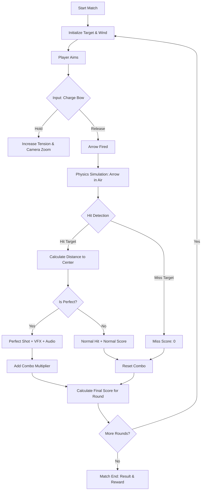
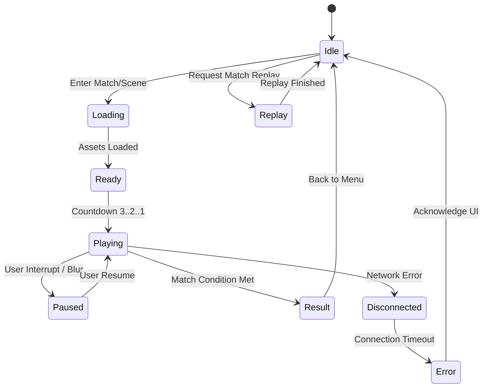

# Game Engine Architecture & Gameplay Software Design Specification

## 1. Engine Overview

### Filosofi Game Engine
Game Engine untuk GameFi Archery dirancang dengan filosofi **"Lightweight, Deterministic, & Server-Authoritative"**. Mengingat target platform adalah browser (desktop dan mobile), engine harus bekerja secara efisien tanpa memerlukan spesifikasi hardware tinggi, meminimalisir waktu muat (loading time), serta mampu memberikan pengalaman bermain yang mulus di 60 FPS. 

Karena game ini memiliki elemen Web3 dan kompetisi berbasis skor, engine **harus deterministik**—sebuah input (tarikan busur) yang sama dengan kondisi lingkungan (angin, jarak) yang sama harus selalu menghasilkan skor yang sama, baik ketika dimainkan secara live maupun diputar ulang (ghost replay).

### Batas Tanggung Jawab

| Komponen | Tanggung Jawab |
| :--- | :--- |
| **React / Next.js** | Menangani antarmuka luar game (Out-of-Game UI), seperti otentikasi (Connect Wallet), navigasi menu utama, Shop, Profile, Leaderboard, Inventory, Season Pass, dan transaksi Web3 (Minting, Pembelian). React bertindak sebagai *wrapper* di sekitar Game Engine Canvas. |
| **Backend API** | Menangani sistem akun, persistensi inventory, Matchmaking, ELO Rating, *Server-Authoritative Validation* (memutar ulang input pemain untuk memvalidasi skor, mencegah kecurangan), dan menyediakan data metadata NFT. |
| **Game Engine** | Bertanggung jawab penuh terhadap perenderan grafis 3D (Three.js), simulasi fisika (Physics), input pemain saat pertandingan, siklus bermain (gameplay loop), efek visual, pemutaran audio game, sistem Ghost Replay, serta pengiriman hasil ke Backend dan metrik tampilan ke HUD (React). |

---

## 2. Engine Architecture

Arsitektur engine menggunakan pendekatan modular berbasis *Service Locator* atau *Dependency Injection* ringan. 

```text
+-----------------------------------------------------------------------------------------+
|                                    GAME ENGINE CORE                                     |
+-----------------------------------------------------------------------------------------+
|  +-------------------+  +-------------------+  +-------------------+  +--------------+  |
|  |   Scene Manager   |  |    Game Manager   |  |   State Machine   |  |   Event Bus  |  |
|  +-------------------+  +-------------------+  +-------------------+  +--------------+  |
+-----------------------------------------------------------------------------------------+
|                                  SUBSYSTEMS & MODULES                                   |
+-----------------------------------------------------------------------------------------+
|  +----------+  +---------+  +---------+  +--------+  +--------+  +--------+  +-------+  |
|  | Renderer |  | Physics |  |  Input  |  | Camera |  | Audio  |  | Assets |  | Replay|  |
|  | (ThreeJS)|  | (Custom)|  |(Gamepad/|  |(Aim/   |  |(Web    |  |(GLTF/  |  |(Ghost)|  |
|  |          |  |         |  | Touch)  |  | Replay)|  | Audio) |  | KTX2)  |  |       |  |
|  +----------+  +---------+  +---------+  +--------+  +--------+  +--------+  +-------+  |
+-----------------------------------------------------------------------------------------+
|                                      BRIDGES                                            |
+-----------------------------------------------------------------------------------------+
|    +--------------------------+  +------------------------+  +---------------------+    |
|    | HUD Bridge (To React)    |  | Network Bridge (To API)|  | Storage (Local DB)  |    |
|    +--------------------------+  +------------------------+  +---------------------+    |
+-----------------------------------------------------------------------------------------+
```

---

## 3. Scene Architecture

Engine menggunakan sistem multi-scene untuk mengisolasi logika dan memori. Hanya satu *Scene* utama yang aktif pada satu waktu, didukung oleh *Overlay Scene* (seperti HUD).

### Struktur Scene
* **Boot Scene**: Inisialisasi engine awal, konfigurasi WebGL, mempersiapkan service dasar.
* **Loading Scene**: Memuat aset awal, *fonts*, shader, dan material dasar yang dibutuhkan secara global.
* **Main Menu**: Render avatar 3D pemain dengan *equipped items*, background statis yang hemat baterai.
* **Lobby**: Persiapan sebelum pertandingan. Menampilkan *ghost* lawan (avatar lawan) dan menunggu koneksi awal backend.
* **Practice**: Mode pemain tunggal. Lingkungan memanah statis.
* **PvP**: Mode utama kompetitif. Lingkungan memanah dengan target dan pemain *ghost* (opsional dirender di sebelah pemain).
* **Result**: Scene transisi yang merender highlight skor, piala, dan animasi kemenangan/kekalahan.
* **Replay**: Scene khusus untuk memutar ulang *Match History*.
* **Settings**: Scene *overlay* (dirender di atas React UI jika butuh kalibrasi 3D) atau murni React.
* **Profile Preview**: Scene khusus untuk merender inspeksi 3D karakter.
* **Shop Preview**: Scene khusus untuk merender barang di toko sebelum dibeli (bisa diputar 360 derajat).

### Lifecycle Scene
1. `init(payload)`: Inisialisasi data scene.
2. `load()`: Mengunduh/menyiapkan memori untuk aset spesifik scene tersebut.
3. `start()`: Memasukkan objek ke graph dan mulai rendering.
4. `update(dt)`: Berjalan setiap *frame* (termasuk fisika dan logika).
5. `stop()`: Menghentikan logika, menyembunyikan objek.
6. `cleanup()`: Menghapus referensi memori, membebaskan tekstur dan geometri.

---

## 4. Game Loop

Game loop memisahkan *logic update* (fisika/gameplay) dari *render update* untuk memastikan determinisme, menggunakan pola *Fixed Time Step* untuk fisika.

```text
GameLoop.tick(timestamp)
  │
  ├── 1. Calculate Delta Time (dt) & Accumulator
  │
  ├── 2. Input Polling
  │      (Mouse, Touch, Keyboard)
  │
  ├── 3. Fixed Update (while accumulator >= FIXED_STEP)
  │      ├── Update Physics (Gravity, Wind, Velocity)
  │      ├── Collision Detection (Arrow vs Target)
  │      ├── Game Logic (Scoring, Ghost Update)
  │      └── accumulator -= FIXED_STEP
  │
  ├── 4. Update (Variable Time Step)
  │      ├── Update Camera (Interpolation, Shake)
  │      ├── Update Animation (Bow draw, Avatar)
  │      ├── Update Particles / VFX
  │      └── Audio Mixing / Spatial Update
  │
  ├── 5. Rendering
  │      ├── Frustum Culling
  │      ├── Render Main Scene (Three.js WebGLRenderer)
  │      └── Render Post-Processing (Bloom, UI Overlay)
  │
  ├── 6. Network / Bridge Sync
  │      ├── Flush HUD Events (Score to React)
  │      └── Send/Receive RPC (if needed)
  │
  └── 7. requestAnimationFrame(tick)
```

---

## 5. Gameplay Architecture

### Alur Gameplay (Flow Diagram)



### Komponen Gameplay
* **Aim**: Input dari layar sentuh atau mouse untuk mengarahkan reticle.
* **Charge**: Menahan klik/sentuhan membangun *tension* busur (mengatur kekuatan tembakan).
* **Wind**: Vektor lingkungan acak per ronde yang menggeser lintasan panah.
* **Hit Detection**: Raycasting / Sphere Cast yang divalidasi terhadap cincin *Target Face* untuk menentukan skor (1-10).
* **Perfect Shot**: Jika panah mendarat di *bullseye* yang sangat sempit, akan memicu efek visual khusus dan bonus.
* **Combo**: Bertahan selama tembakan berturut-turut berujung nilai tinggi (misal: berturut-turut skor 9 atau 10).
* **Score & Multiplier**: Skor dasar dikalikan Combo, kemudian dikumpulkan di akhir permainan untuk XP dan poin ELO.
* **Reward/Result**: Disinkronkan dengan backend setelah ronde selesai.

---

## 6. Physics System

Fisika adalah fondasi determinisme game ini. Game **tidak menggunakan physics engine umum (seperti Cannon.js/Ammo.js)** karena terlalu *bloated* dan sulit menjamin determinisme lintas *platform/browser*.

* **Custom Physics**: Menggunakan integrasi Euler sederhana atau *Verlet* untuk peluru panah.
* **Fixed Update**: Berjalan secara ketat di *fixed time step* (misal `1/60` detik), lepas dari framerate *rendering*.
* **Arrow Velocity & Gravity**: Panah memiliki massa, gravitasi konstan, dan kecepatan awal berdasarkan durasi *Charge*.
* **Wind**: Menerapkan gaya akselerasi samping (lateral force) pada panah di udara.
* **Collision**: Tabrakan hanya dihitung secara analitik (Sphere vs Plane/Cylinder) saat proyektil melintas, karena dunia sebagian besar statis.
* **Deterministic & Server Validation**: Backend menggunakan kode fungsi fisika TypeScript yang sama persis (tanpa rendering) untuk memvalidasi posisi rilis panah (`startPos, directionVector, power`) dari klien dan memverifikasi skor akhir.
* **Floating Point Handling**: Untuk menjamin kesamaan hasil kalkulasi floating point antar browser dan server (Node.js), komputasi penting akan menggunakan fixed-point math (`int` dengan pembagian skala) untuk logika inti lintasan.
* **Replay Compatibility**: Sistem physics menggunakan seed yang sama sehingga pemutaran replay 100% identik pergerakannya.

---

## 7. Input System

Sistem Input diabstraksi dari *hardware* untuk memudahkan implementasi lintas perangkat.

* **Pointer Input**: Mouse (Desktop) dan Touch (Mobile). Digunakan untuk *dragging* (Aiming) dan penahanan (Charge).
* **Keyboard/Gamepad**: Ekstensi masa depan (D-Pad untuk membidik, tombol bahu untuk menarik busur).
* **Sensitivity & Aim Assist**: Opsi kalibrasi sensitivitas. Aim assist mungkin hadir secara *soft* (magnetik ringan) di layar sentuh untuk mengompensasi kontrol yang tidak presisi demi *accessibility*.
* **Dead Zone**: Digunakan pada *stick* gamepad atau area tepi *touchscreen* untuk menghindari input tidak sengaja.
* **Input Buffer**: Merekam input beberapa milidetik sebelum animasi sepenuhnya siap agar tidak terasa jeda.

---

## 8. Camera System

Kamera dinamis sangat penting untuk memberikan nuansa "Impactful" (Berdampak).

* **Gameplay Camera**: Sudut pandang *Third-Person* dari bahu avatar, agak statis saat istirahat.
* **Aim Camera**: Saat busur ditarik (Charge), *Field of View (FOV)* mengecil perlahan (Zoom-in), dan kamera bergerak sedikit ke sisi panah.
* **Arrow Follow Camera (Replay)**: Mengikuti panah di udara saat momen epik (Perfect Shot/Match Point).
* **Target Tracking**: Kamera sedikit bergeser mengikuti reticle bidikan.
* **Camera Shake**: Guncangan kecil saat busur dilepaskan, dan guncangan lebih besar saat mengenai target.

---

## 9. Asset Pipeline

Aset harus memuat dengan sangat cepat.

* **Format 3D**: `GLTF` dan `GLB` yang dikompresi dengan Draco untuk mesh geometri.
* **Texture**: WebP untuk kompabilitas, atau Format *Hardware Compressed* (KTX2/Basis) jika perangkat mendukung, untuk mengurangi pemakaian VRAM secara drastis.
* **Audio**: `WebAudio API`, aset berupa `.mp3` atau `.ogg`.
* **Streaming & Preload**: Hanya memuat aset untuk ronde tersebut (Pemain dan Ghost lawan). Memuat background level di awal.
* **LOD (Level of Detail)**: Target jarak jauh menggunakan geometri sederhana. Avatar *ghost* di kejauhan tidak perlu dirender penuh.
* **CDN & Cache**: Menggunakan Service Worker dan *Cache Storage API* di browser untuk mempertahankan aset (versioning check), sehingga muatan berikutnya tidak memerlukan bandwidth (instan).
* **Memory Budget**: Menggunakan pengawasan ketat terhadap jumlah tekstur dan mesh. Aset memori puncak tidak boleh melebihi 200MB.

---

## 10. Equipment System

Sistem modul kosmetik yang memproses data dari Backend (Inventori) ke Engine.

* **Proses (Load & Instantiate)**:
  1. Engine membaca JSON *Loadout* pemain (`user.equipped_items`).
  2. Asset Loader memeriksa Cache lokal. Jika tidak ada, panggil CDN.
  3. Memuat `.glb` (Bow, Arrow, dsb).
  4. Menyatukan ke kerangka avatar (*Bone Attachment*).
* **Komponen Kosmetik**:
  * **Bow & Arrow Skin**: Ditautkan ke *Bone* Tangan Kiri dan Kanan.
  * **Trail & Hit Effect**: Memilih prefab *Particle System* spesifik berdasarkan ID kosmetik.
  * **Banner & Avatar**: Dimuat pada *Main Menu* dan *Lobby*.
  * **Emote**: Memuat klip animasi `.gltf` yang akan memicu transisi di Animation Mixer.
* **Swap & Cache**: Saat menukar (swap) equipment di profile, model yang sebelumnya dimuat disimpan di pool untuk kecepatan penukaran kembali.
* **Fallback**: Jika NFT lambat dimuat atau gagal diunduh, gunakan *Default Bow / Default Skin* secara instan. Tidak boleh mengganggu permainan.

---

## 11. Ghost Replay System

Untuk MVP PvP asinkronus (bermain melawan jejak rekaman pemain lain).

* **Recording**: Selama permainan, engine merekam vektor input, orientasi bidikan, kekuatan tarikan busur, stempel waktu, dan hasil acak (seed angin) ke dalam struktur array sederhana.
* **Compression**: Data *Ghost* dikompresi (misal: JSON diubah menjadi format biner ringan) sebelum *Upload* ke server.
* **Playback**: Saat PvP, klien mengunduh metadata Ghost lawan. Mesin mereplikasi input pada frame waktu yang tepat ke avatar Ghost (AI dikendalikan rekaman).
* **Synchronization & Interpolation**: Simulasi menggunakan *deterministic random seed* agar *environment* (angin, rintangan) sama persis antara putaran Ghost aslinya dan putaran pemutaran ulang. Posisi kamera antar tick akan diinterpolasi untuk mulusnya pemutaran.
* **Integrity Check**: Mencocokkan skor akhir putaran Ghost dengan rekam jejak di database. Jika berbeda (mungkin masalah *Version Compatibility* patch sebelumnya), putar animasi *default hit* sesuai skor database.

---

## 12. HUD Bridge

Memisahkan game engine (WebGL) dari UI Overlay (React HTML/CSS). Keduanya berkomunikasi melalui Event Bus atau State Manager terpusat (seperti Zustand yang diekspos ke objek window/engine).

### Komunikasi Engine $\rightarrow$ React (Event Driven)
* **HUD.UpdateScore(score, combo)**: Merender animasi skor di UI React.
* **HUD.UpdateWind(direction, speed)**: Mengubah arah panah indikator angin di UI.
* **HUD.UpdateTimer(time)**: Mengubah sisa waktu ronde (jika ada).
* **HUD.ShowHitNotification("Perfect!")**: Memunculkan teks *pop-up* dan *accuracy* di React.
* **HUD.MatchEnd(results)**: Memanggil layar *Result* di React, Engine mengaburkan (blur) layar belakang.

### Komunikasi React $\rightarrow$ Engine
* **Engine.Pause() / Engine.Resume()**: Dipanggil ketika pemain membuka menu *Settings* / *Inventory* React.
* **Engine.EquipPreview(itemId)**: Digunakan di halaman *Inventory* (React) untuk menyuruh Engine memuat aset ke pratinjau 3D.

---

## 13. Audio System

* **Mixer Node**: Dikelompokkan menjadi Master, BGM (Background Music), SFX, dan Ambient. Pengguna dapat mengatur volume masing-masing via Settings.
* **Audio Pool**: Melakukan pra-inisiasi beberapa *AudioContext buffer* untuk suara yang sering diputar berulang (seperti suara "woosh" panah) agar tidak ada *delay* alokasi.
* **Spatial Audio (Positional)**: Memanfaatkan `PannerNode` WebAudio sehingga jika panah Ghost lawan meleset di sebelah kiri pemain, suara mendarat terdengar dari telinga/speaker kiri.
* **Kategori Bunyi**: Suara tarikan tali busur (pitch meningkat sesuai *tension*), rilis panah, dampak (Hit/Perfect Shot dipisahkan berdasarkan target), Combo crescendo, dan notifikasi UI.

---

## 14. Visual Effect System

* **Particle System**: Engine kustom sederhana atau turunan untuk Three.js (seperti *InstancedMesh* untuk proyektil jamak) guna membuat debu, serpihan target (Hit Impact), dan percikan kosmetik.
* **Arrow Trail**: Efek pita cahaya yang dirender dengan membuat geometri kustom yang mengekstrusi titik orientasi lintasan panah terakhir (Ribbon/Trail Mesh).
* **Wind Effect**: Garis-garis halus memanjang di layar (Speed lines) menunjukkan arah dan kekuatan angin (Screen Effect).
* **Combo Effect**: Perubahan pencahayaan kecil dan letupan partikel khusus saat combo sangat tinggi.
* **Post-Processing (Opsional/High-End)**: Menggunakan `EffectComposer`. Filter seperti *Bloom* (untuk efek menyala kosmetik langka) dan *Motion Blur*. Dapat dimatikan di perangkat *low-end* agar hemat *Performance Budget*.

---

## 15. Performance Strategy

Game web harus menghormati memori tab browser dan keterbatasan baterai mobile.

* **Target FPS**: 60 FPS di desktop; setidaknya stabil 30-60 FPS pada perangkat mobile (iOS/Android).
* **Object Pooling**: Anak panah, partikel efek, dan teks angka *damage* (jika 3D) dialokasikan di awal permainan. Daripada memanggil `new Object()` dan menghapusnya, item akan disembunyikan dan didaur ulang saat tembakan berikutnya.
* **Draw Call Reduction**: Menggunakan *Texture Atlas*, dan *Instancing* jika merender objek yang identik secara visual (seperti banyak batu atau pohon rumput latar belakang).
* **Frustum & Occlusion Culling**: Partikel di luar sudut pandang tidak diperbarui logikanya.
* **GC (Garbage Collection) Reduction**: Menghindari pembuatan objek/array baru di dalam iterasi *Game Loop* utama (menggunakan vektor variabel statis kelas/sementara: `v1.set(x,y,z)` daripada `new Vector3()`).
* **Mobile & Battery Optimization**: Deteksi rasio piksel layar gawai. Membatasi resolusi render maksimum, menurunkan tick rate particle saat tidak aktif.
* **Shader Strategy**: Menggunakan varian shader *unlit* atau shader Lambertian sederhana untuk geometri tidak penting.

---

## 16. Event System

Komunikasi antar-subsistem pada game engine mengandalkan arsitektur *Pub/Sub*.

| Event Name | Publisher | Subscriber | Payload |
| :--- | :--- | :--- | :--- |
| `SceneLoaded` | SceneManager | GameManager, Audio | `sceneName` |
| `GameStarted` | GameManager | HUD Bridge, Physics | `matchId, windSeed` |
| `ArrowReleased` | InputSystem | Physics, Audio, VFX | `origin, vector, power` |
| `ArrowHit` | Physics | GameManager, HUD Bridge | `score, isPerfect, position` |
| `ComboChanged` | GameManager | HUD Bridge, Audio | `currentComboMultiplier` |
| `ReplayStarted` | ReplayManager | SceneManager, Camera| `replayId, playerInfo` |
| `ReplayFinished`| ReplayManager | SceneManager | `winner, scoreData` |
| `MatchFinished` | GameManager | Network Bridge, HUD | `finalScores, matchData` |
| `EquipmentChanged` | React/HUD | AssetSystem, Renderer | `playerId, equipmentIds` |
| `AssetLoaded` | AssetLoader | GameManager, UI | `assetId, url` |
| `SettingsChanged` | UI Bridge | Renderer, Audio | `key, newValue` |

---

## 17. State Machine

Digunakan oleh GameManager untuk mengatur jalannya keseluruhan aplikasi.



---

## 18. Save System

Data lokal akan disimpan menggunakan `LocalStorage` atau `IndexedDB`.

* **Apa yang Disimpan Lokal**:
  * **Settings**: Konfigurasi Volume (Master, BGM, Audio). Konfigurasi Grafis (Quality preset: Low/Med/High).
  * **Input & Accessibility**: Sensitivitas Input & Aim Assist toggle.
  * **Temporary State**: Cache sesi UI terakhir yang dibuka.
  * **Replay Cache & Offline Cache**: *Offline Cache* untuk rekaman putaran Ghost baru (sebelum berhasil diunggah ke backend).
* **Apa yang TIDAK Boleh Disimpan Lokal**:
  * Saldo *Soft Currency* atau status kepemilikan NFT.
  * ELO Rating dan inventori final (semuanya adalah data *read-only* dari backend).

---

## 19. Error Recovery

* **Lost Asset (Texture/Audio Missing)**: Otomatis me-*fallback* ke geometri *placeholder* transparan atau material bawaan. Memastikan tabrakan (physics) tidak terganggu karena hilangnya material render. Jika *Audio* gagal, mainkan tanpa suara diam-diam.
* **RPC Failure / Backend Timeout**: Menampilkan pesan peringatan di UI. Di mode PvP, Ghost data akan diambil ulang, jika gagal berulang kali, otomatis me-retur pemain ke *Main Menu*.
* **Replay Failure**: Data replikasi Ghost salah/rusak; ganti dengan bot dasar secara transparan bagi pengguna agar match bisa diselesaikan.
* **Context Lost**: Terjadi jika OS browser/GPU mereset memori (`webglcontextlost`). Engine akan menangkap ini, me-reset seluruh cache tekstur dan meminta shader dikompilasi ulang tanpa membatalkan *match state* di memory JS (Recovery Strategy).
* **Disconnected**: Transisi ke state offline, jeda (Pause) match untuk sementara dan usahakan reconnect (kecuali PvP sync kritis).
* **Low Memory**: Deteksi penurunan *frame time* mendadak. Jika GC berjalan agresif, pangkas objek dari *Object Pool* dan turunkan kualitas post-processing.

---

## 20. Decision Matrix

Berikut merupakan acuan arsitektur yang ditetapkan dari berbagai alternatif solusi:

| Keputusan Sistem | Alternatif Dipertimbangkan | Kelebihan Pilihan (Alasan) | Kekurangan Pilihan | Alasan Pemilihan (Final) |
| :--- | :--- | :--- | :--- | :--- |
| **Engine Render** | Babylon.js vs PlayCanvas | **Three.js**: Ekosistem masif, ukuran bundel kecil, integrasi mudah di React. | Kurangnya editor visual bawaan. | Kustomisasi murni dengan React. Komunitas besar dan referensi berlimpah untuk Web3. |
| **Simulasi Fisika** | Cannon.js / Ammo.js | **Custom Physics**: Sangat ringan. 100% Deterministik di server maupun klien. | Harus menulis ulang logika tabrakan manual (math). | Fisika 3D umum terlalu berat dan sulit dijamin *floating point determinism*-nya untuk Ghost Replay. |
| **Sistem Scene** | Single Scene | **Multi Scene**: Memori dapat dibersihkan (*garbage collected*) antar scene dengan aman. | Perlu loading antar scene. | Membantu di platform *mobile* di mana memori sangat terbatas. |
| **Sistem Objek** | Dinamis (*Instancing on the fly*) | **Object Pool**: Penggunaan GPU dan CPU yang stabil tanpa lonjakan GC. | Kompleksitas saat me-reset state pool. | Di browser, GC *hiccup* sangat terasa. Pool mengatasinya. |
| **Networking PvP** | WebSocket (Live Match) | **REST / Ghost Replay**: Skalabilitas luar biasa, bebas latensi kritis, tidak ada waktu tunggu *matchmaking*. | Interaksi murni hanya *asynchronous*. | Solusi MVP Web3 berbasis web untuk retensi maksimal tanpa server *real-time* mahal. |
| **Sistem UI (HUD)** | WebGL Canvas UI | **React HTML/DOM**: Mudah menyusun UI kompleks & menghubungkan *Wallet/Smart Contract*. | Overhead event transfer kecil. | WebGL difokuskan 100% ke rendering 3D, React menangani UI statis & DOM yang jauh lebih cocok. |
| **Format Aset 3D** | FBX, OBJ | **GLTF / GLB**: Standar web masa depan. Dapat dipadu dengan tekstur WebP. | Butuh *asset pipeline builder* pra-deploy. | Ekstrim cepat. Sesuai arsitektur *Asset Pipeline*. |
| **Asset Compression** | PNG/JPEG biasa | **Draco (Geometry) / Basis (Texture)**: Mengurangi beban unduh dan VRAM sangat masif. | Butuh module *WASM loader* (DracoDecoder). | Penting untuk menghindari kehabisan memori (*Context Lost*) di perangkat iOS/Android. |
| **Replay Format** | Snapshot State per Frame | **Input Recording Format**: Hanya merekam *vektor* dan *power* input serta stempel waktunya. | Butuh *deterministic physics* murni saat diputar ulang. | Ukuran *payload* JSON ke database sangat kecil (di bawah 5 KB per match). |
| **Input Strategy** | Web API Mouse/Keyboard biasa | **Pointer & Unified Touch**: Normalisasi input untuk menjembatani mouse desktop dan layar HP. | Butuh pengaturan sensitivitas layar spesifik. | Menjamin rasa permainan (*game feel*) yang konsisten di semua jenis peramban. |

---
*Dokumen ini merupakan Game Engine Software Design Specification (SDS) resmi yang akan digunakan sebagai pedoman dalam tahap pengembangan, melengkapi dokumen PRD, Backend, dan Smart Contract sebelumnya.*
